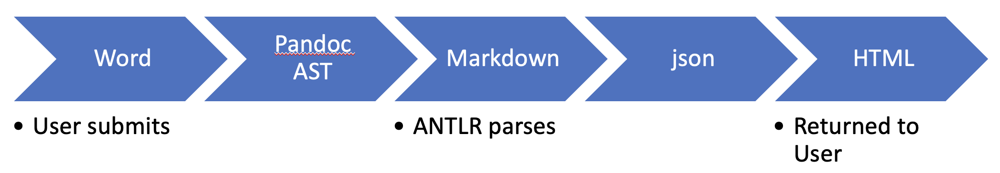

# Architecture

Qcon-api is the backend processor to the Qcon-web interface; together, they compose the Qcon service.

The foundation of Qcon-api is [Django](https://www.djangoproject.com/). We chose this framework because of the breadth and maturity of plugins to help us get up and running quickly.

Under the hood, documents are ingested and converted into markdown by [Pandoc](https://pandoc.org/), and then parsed by [ANTLR](https://www.antlr.org/).

