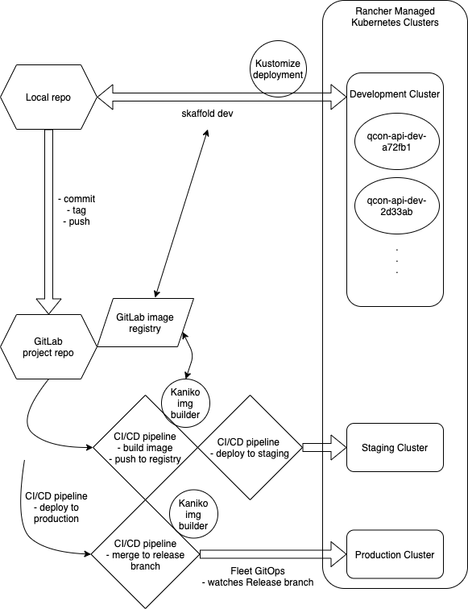

# Git Repo Structure

Qcon-api uses [Kustomize](https://kustomize.io/) to apply development, staging, and production paramters to the build and deployment. The project expects a `Base` folder for common deployment paramters and `Overlays` for development, staging, and production.

# Deployment Strategy

## Development

The dev environment uses [Skaffold](https://skaffold.dev/) to take care of rebuilding the container and automatically deploying it to a cluster for verification. The setup is initiated by running `skaffold dev`.

Development deployment paramters:
* deploys locally-built image
* requests small persistent volume

## Staging

The staging environment uses `skaffold build` to deploy a version of the app built by in-cluster by [Kaniko](https://github.com/GoogleContainerTools/kaniko).

## Production

Production builds are initiated by a [GitLab Runner]() pipeline. The release branch is watched by [Rancher Fleet](), which takes care of deploying the app to the production cluster, (Kustomized-like).

* Git tag: v{major}.{minor}.{patch}
* Image tag: stable
* Deployment branch: release

