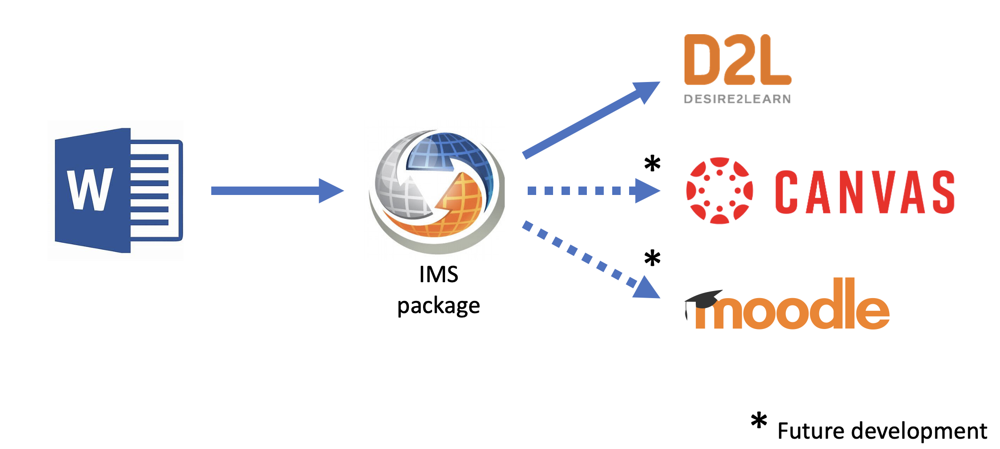

# Introduction

Qcon-api is a question conversion processor that enables accurate text conversion from Word into an LMS import package. It is part of the Qcon service.

## General functions

This api app is the parser and packager component of the Qcon service. Qcon-api:

1. Receives a Word document input
2. Parses out questions and options
3. Presents a summary of what was found
4. Builds a package for upload to an LMS

For full Qcon service usage and Word formatting documentation see the [Qcon User Guide](https://issues.ltc.bcit.ca/web-apps/qcon/user-guide/).