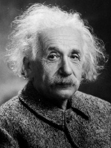

# Ideal Standard - Multi-Select (M-S) - Respondus format - Word -- answers @ end

Type: MR

1.  Which of (1) the following **individuals** are credited with determining the exact speed of light?

    a.  Albert Einstein

    b.  Albert Michelson

    c.  Edward Williams Morley

    d.  Thomas Edison

Type: MR

2.  Which of (2) the following **individuals** are credited with determining the exact speed of light?\
    @ Blah Blah overall feedback

    e.  Albert Einstein

    f.  Albert Michelson

    g.  Edward Williams Morley

    h.  Thomas Edison

Type: MR

Title: Who (3) determined the exact...

3.  Which of the following **individuals** are credited with determining the exact speed of light?\
    @ Blah Blah overall feedback

    i.  Albert Einstein

    j.  Albert Michelson

    k.  Edward Williams Morley

    l.  Thomas Edison

Type: MR

Title: Who (4) determined the exact...

4.  Which of the following **individuals** are credited with determining the exact speed of light?\
    @ Blah Blah overall feedback

    a.  Albert Einstein

    b.  Albert Michelson

    c.  Edward Williams Morley

    d.  Thomas Edison

Type: MR

Points: 2

Title: Who (5) determined the exact...

5.  Which of the following **individuals** are credited with determining the exact speed of light?\
    @ Blah Blah overall feedback

    m.  Albert Einstein

    n.  Albert Michelson

    o.  Edward Williams Morley

    p.  Thomas Edison

Type: MR

Title: Who (6) determined the exact...

6.  Which of the following **individuals** are credited with determining the exact speed of light?\
    {width="0.8059700349956256in" height="1.0749803149606298in"} {width="0.84375in" height="1.0798611111111112in"}\
    @ Blah Blah overall feedback

    q.  Albert Einstein

    r.  Albert Michelson

    s.  Edward Williams Morley

    t.  Thomas Edison

Type: MR

Title: Who (7) determined the exact...

7.  Which of the following **individuals** are credited with determining the exact speed of light?\
    {width="0.8280850831146107in" height="1.1044772528433946in"} {width="0.84375in" height="1.0798611111111112in"}\
    @ Blah Blah overall feedback

    u.  Albert Einstein\
        @ Yes, sort of

    v.  Albert Michelson\
        @ You are correct, sir!

    w.  Edward Williams Morley\
        @ Incorrect, sorry\
        {width="1.400559930008749in" height="0.9375in"}

    x.  Thomas Edison\
        @ Try again

Type: MR

Title: Who (8) determined the exact...

8.  Which of the following individuals are credited with determining the exact speed of light?\
    See this video:\
    source: <https://www.youtube.com/embed/fpJdq12ddgk>\
    @ Blah Blah overall feedback

    y.  Albert Einstein

    z.  Albert Michelson\
        @ You are correct, sir!\
        $A = \pi r^{2}$

    a.  Edward Williams Morley

    b.  Thomas Edison

Answers:

1.  a, b

2.  a, b

3.  a, b

4.  a, b

5.  a,b

6.  a,b

7.  a,b

8.  a,b
